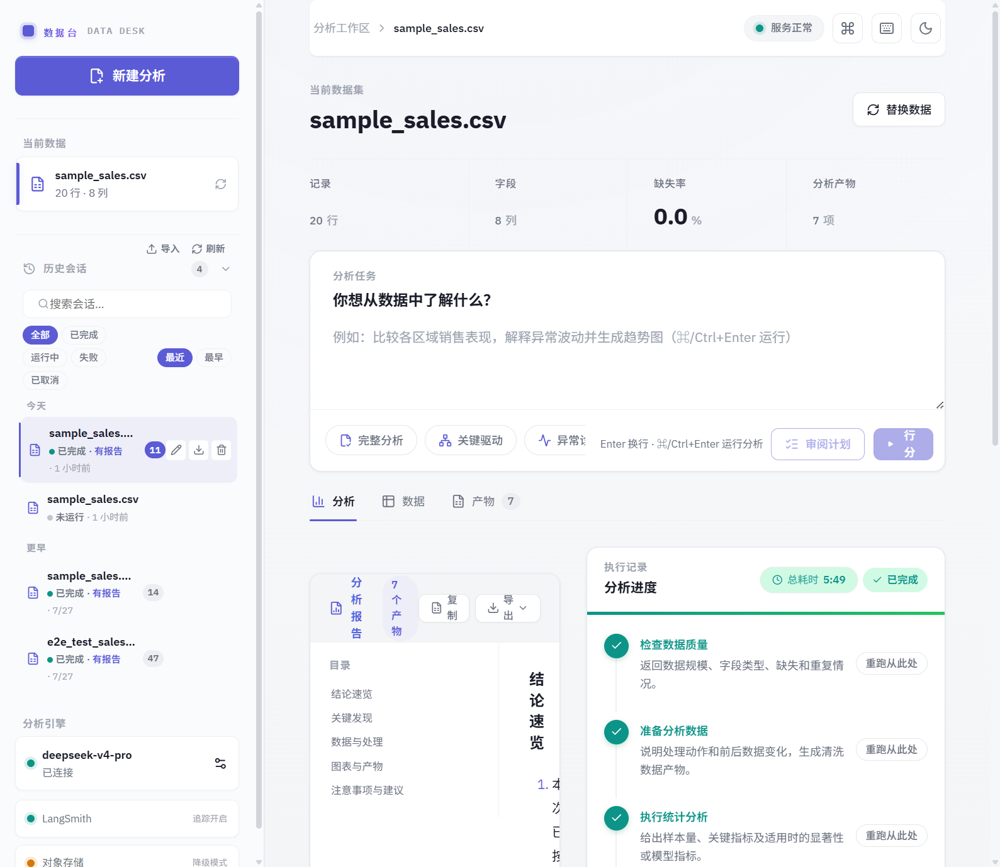
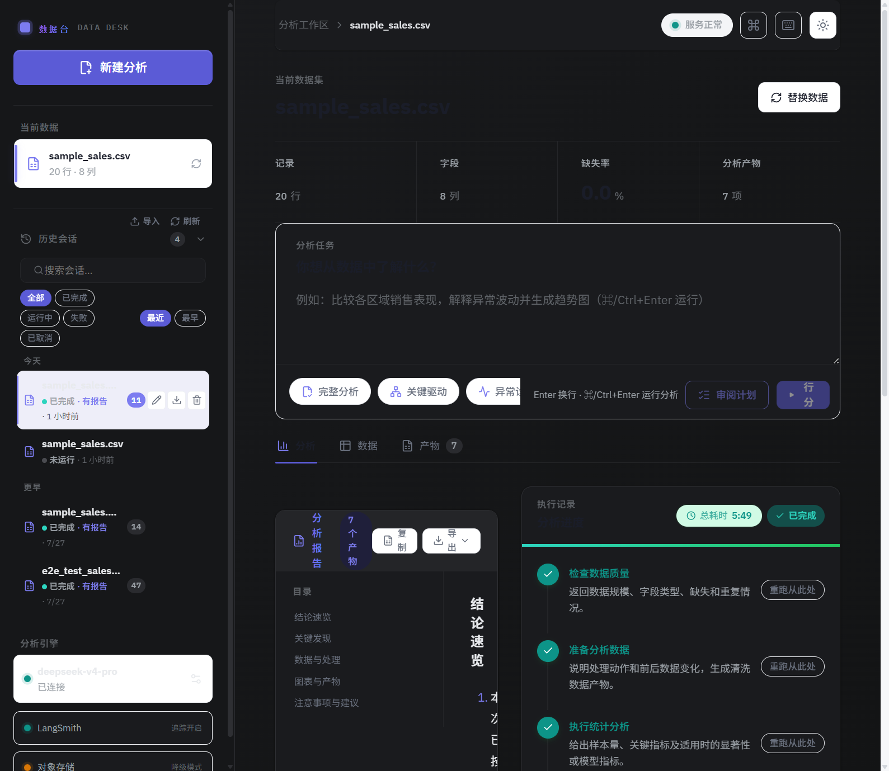
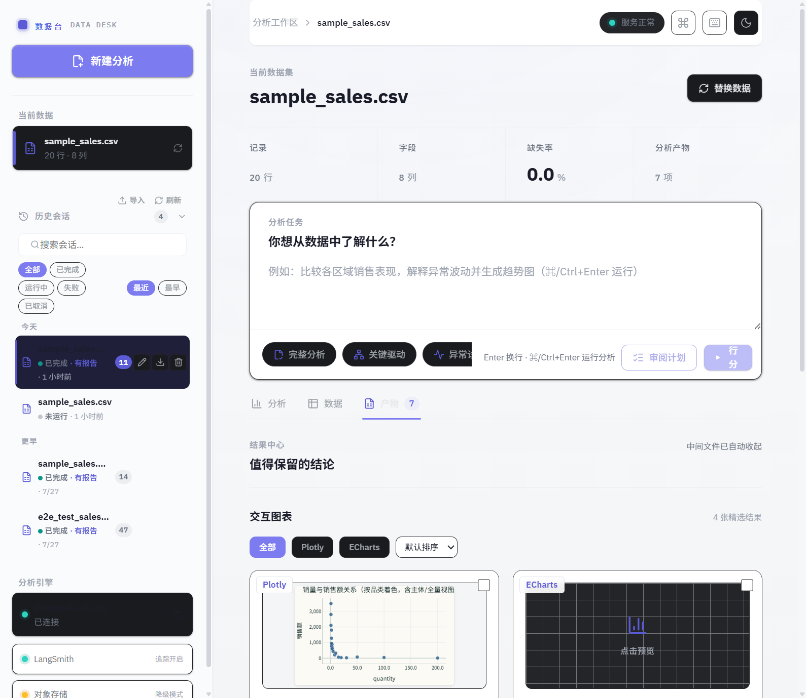
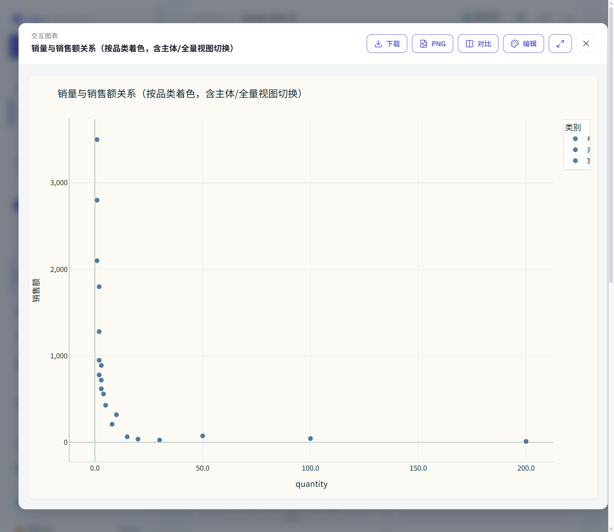

# Data Analysis Agent

一个基于 LLM 的全流程数据分析工作台：上传数据集，即可自动完成数据检查、清洗、统计分析、可视化与报告生成。适合需要快速从表格数据中获得可靠洞察的分析师、运营与数据工作者。

后端采用 LangChain + LangGraph 的 Plan-and-Execute + ReAct 混合架构，前端为独立 React 应用，本地通过 HTTP/SSE 通信。可一键本地运行，也可部署到 LangSmith / Render / Docker。

<p align="center">
  
  <br />
  <em>全流程工作台：数据概览 → 分析任务 → 实时执行进度 → 结构化报告</em>
</p>

## 界面预览

| 浅色主题 · 分析工作区 | 深色主题 · 分析工作区 |
| :---: | :---: |
|  |  |
| 产物中心 · 图表与数据文件 | 图表预览 · 交互式 Plotly / ECharts |
|  |  |

## 功能特性

- **计划-执行式分析流程**：每次分析先生成 2–6 个结构化步骤，每个步骤由 ReAct 执行器调用受控工具完成；重规划器根据真实工具结果删除无用步骤、补充后续分析，证据充分时提前结束，达到步骤上限时强制汇总，避免无限循环。
- **受控数据工具集**（8 个内置工具）：数据检查、格式修复、安全清洗、非破坏性筛选视图、统计分析、图表生成、数据导出、受限 Python 沙箱。
  - 清洗带安全护栏：缺失值删除比例超过 50% 会拒绝执行，主数据行数始终不低于原始行数的 20%。
  - 统计方法覆盖描述统计、相关分析（含 Pearson p 值）、分组聚合、独立/配对 t 检验、ANOVA、卡方检验、线性回归（R² / RMSE / MAE）。
- **双图表引擎**（Plotly + ECharts）：共享同一套数据准备逻辑，支持折线、柱状、散点（含 3D）、直方图、箱线图、小提琴图、饼图、热力图、相关热力图、散点矩阵、旭日图、矩形树图；自动选图、极端值自动检测与主体尺度/全量视图切换、暗色主题联动、PNG 导出、数据驱动的白话解读。
- **多格式数据接入**：CSV / TSV / Excel / JSON / JSONL / Parquet，以及 PDF 表格提取、TXT、Word 表格；自动探测编码（UTF-8 / GB18030）与分隔符，大文件分块流式读取，数值列自动降级数据类型以节省内存。
- **全流程 Web 工作台**：文件上传（含进度与取消）、数据概览指标、分析任务与预设模板、计划审阅/批准、实时步骤与工具调用进度（SSE + 15 秒心跳）、随时取消分析、报告生成后的多轮追问、产物中心（预览/对比/PNG/批量下载）、历史会话（重命名/删除/导出 ZIP/导入）、命令面板与快捷键、深浅主题、移动端适配。
- **断点续跑与自动恢复**：分析中断后可从已完成的步骤继续，无需重跑；前端支持 SSE 断线自动恢复与一键重试。
- **安全与访问控制**：可选访问令牌（`APP_ACCESS_TOKEN`）、滑动窗口速率限制、CORS / GZip / 安全响应头；API Key 通过操作系统凭据库（keyring）保存，不落明文文件。
- **会话持久化**：本地或 S3 兼容对象存储（如 Cloudflare R2）双后端，会话按 session id 自动归档/恢复，带路径穿越防护。
- **可观测与部署**：LangSmith 全链路 Trace（规划、每次工具调用、重规划、汇总）；LangGraph Agent Server 部署；Dockerfile（非 root 用户 + 健康检查）；Render Blueprint 一键部署；GitHub Actions 自动 CI。

## 技术栈

- 后端：Python 3.11–3.13、FastAPI、Uvicorn、LangChain、LangGraph、LangSmith
- 模型接入：DeepSeek（默认，支持 thinking mode）/ OpenAI 及任意 OpenAI 兼容服务
- 数据分析：pandas、NumPy、SciPy、scikit-learn、Plotly、Kaleido、openpyxl、PyArrow、pdfplumber、python-docx
- 存储：本地文件系统 / boto3（S3 / R2）
- 前端：TypeScript、React 19、Vite、Zustand、lucide-react、motion、react-markdown（Vitest）
- CLI：Typer + Rich

## 快速开始

### 环境要求
- Python 3.11–3.13
- Node.js 20 或更高版本
- 一个 LLM API Key（默认 DeepSeek，也兼容 OpenAI）

### 一键启动（Windows）
双击 `run.bat`。首次运行会自动创建虚拟环境、安装后端依赖并 `npm install`，随后分别启动：

- 前端：http://127.0.0.1:5173
- 后端 API：http://127.0.0.1:8000
- API 文档：http://127.0.0.1:8000/docs

### 手动启动

```powershell
# 后端
python -m venv .venv
.\.venv\Scripts\python.exe -m pip install -e ".[dev]"
Copy-Item .env.example .env   # 编辑填入 DEEPSEEK_API_KEY
.\.venv\Scripts\python.exe -m uvicorn data_agent.api:app --host 127.0.0.1 --port 8000

# 前端（另开终端）
cd frontend
npm install
npm run dev
```

### 命令行分析

```bash
pip install -e ".[dev]"
export DEEPSEEK_API_KEY=<your-key>        # Windows PowerShell: $env:DEEPSEEK_API_KEY="<your-key>"
data-agent analyze examples/sample_sales.csv --task "分析各区域销售趋势"
```

输出为 Markdown 格式分析报告，产物路径一并打印。

## 配置

复制 `.env.example` 为 `.env` 并填写（所有密钥均为占位符）：

```dotenv
MODEL_PROVIDER=deepseek
DEEPSEEK_API_KEY=<your-deepseek-api-key>
DEEPSEEK_MODEL=deepseek-v4-pro
DEEPSEEK_THINKING=true
DEEPSEEK_REASONING_EFFORT=high

# 或使用 OpenAI 兼容服务
OPENAI_API_KEY=<your-api-key>
OPENAI_MODEL=gpt-4.1-mini

# 线上访问保护（公开部署建议设置）
APP_ACCESS_TOKEN=<your-access-token>

# 可选：Cloudflare R2 / S3 兼容持久化
DATA_AGENT_STORAGE_BACKEND=s3
DATA_AGENT_STORAGE_BUCKET=<bucket-name>
DATA_AGENT_STORAGE_ENDPOINT_URL=https://<ACCOUNT_ID>.r2.cloudflarestorage.com
AWS_ACCESS_KEY_ID=<your-access-key-id>
AWS_SECRET_ACCESS_KEY=<your-secret-access-key>
```

完整变量清单见 `.env.example`。

## 项目结构

```
src/data_agent/
  api.py             FastAPI 应用装配与前端静态资源托管
  agent.py           DataAnalysisAgent：Plan-and-Execute + ReAct
  cli.py             Typer 命令行入口
  config.py          环境变量驱动的运行时配置
  nodes/             LangGraph 节点（validate/plan/execute/replan/finalize）
  tools/             ReAct 工具集（检查/清洗/转换/统计/可视化/导出/沙箱）
  echarts_engine.py  ECharts 图表引擎（与 Plotly 引擎并列）
  deployment.py      LangSmith Agent Server 图入口
  storage.py         本地 / S3 兼容对象存储后端
  middleware.py      CORS / GZip / 访问令牌 / 速率限制
  routers/           会话 / 分析 / 产物 / 设置路由
frontend/            React + Vite 前端（含构建产物 frontend/dist）
examples/            示例数据
tests/               pytest 测试
```

## 部署

- **Docker**：根目录 `Dockerfile` 两阶段构建（Node 构建前端 + Python 运行时），以非 root 用户运行并带健康检查。
- **LangSmith**：`langgraph.json` 导出 `data_analysis_agent` 图，可直接创建 LangSmith Deployment；数据集通过 `dataset_id` 或受控 `dataset_path` 提供。
- **Render**：根目录 `render.yaml` 提供 Blueprint 一键部署，附持久磁盘；Free 实例休眠后 `/tmp` 会清空，长期保存数据请启用 S3/R2 后端。
- **CI**：`.github/workflows/ci.yml` 在 push / PR 时自动执行 ruff、pytest（含 120s 单测超时保护）与前端类型检查、测试及生产构建。

## 质量检查

```powershell
.\.venv\Scripts\python.exe -m pytest --cov  # 后端测试（不调用真实 LLM，不产生费用），覆盖率约 100%（源码）
.\.venv\Scripts\python.exe -m ruff check .  # 后端代码检查
cd frontend && npm run typecheck            # 前端 TypeScript 类型检查
cd frontend && npm test                     # 前端单元/组件测试
cd frontend && npm run build                # 前端生产构建
```
