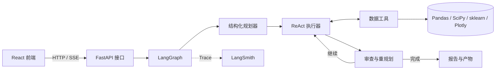

# 数据分析 Agent

一个前后端分离的全流程数据分析工作台。后端使用 LangChain、LangGraph、ReAct 与 Plan-and-Execute，前端使用 React；本地通过独立 HTTP/SSE 接口通信，生产构建可部署到 LangSmith Deployment。

## 架构



后端边界：

- `src/data_agent/api.py`：文件、配置、会话、SSE 分析和产物下载接口。
- `src/data_agent/agent.py`：`validate → plan → execute → replan → finalize` 状态图。
- `src/data_agent/tools/`：检查、清洗、转换、统计、可视化和导出工具（按职责拆分为 `builder`/`charts`/`_cleaning`/`_helpers`）。
- `src/data_agent/deployment.py`：LangSmith Agent Server 图入口。
- `langgraph.json`：LangSmith Deployment 构建配置和自定义 FastAPI 路由。

前端边界：

- `frontend/` 是独立 Vite/React 项目。
- 前端不导入 Python，也不直接访问文件系统。
- 开发环境调用 `http://127.0.0.1:8000`；生产环境默认调用当前部署域名。

## Plan-and-Execute

每次分析会先生成 2 到 6 个结构化步骤。每一步由 ReAct Agent 使用受控工具执行，随后重规划器根据真实工具结果决定：

1. 删除已经没有价值的步骤。
2. 补充必要的后续分析。
3. 证据充分时提前结束。
4. 达到步骤上限时强制汇总，防止无限循环。

最终报告只能引用工具返回的统计数字和生成文件。

## 本地启动

要求 Python 3.11-3.13 和 Node.js 20 或更高版本。

双击 `run.bat`。第一次启动会安装依赖，然后分别启动：

- React：`http://127.0.0.1:5173`
- FastAPI：`http://127.0.0.1:8000`
- OpenAPI：`http://127.0.0.1:8000/docs`

也可以手动启动：

```powershell
.\.venv\Scripts\python.exe -m uvicorn data_agent.api:app --host 127.0.0.1 --port 8000
cd frontend
npm install
npm run dev
```

## API

主要接口：

- `GET /api/health`
- `GET /api/auth`：检查是否需要应用访问令牌
- `GET /api/settings`
- `PUT /api/settings`
- `POST /api/sessions`：multipart 文件上传
- `GET /api/sessions/{id}`
- `POST /api/sessions/{id}/analyze`
- `POST /api/sessions/{id}/analyze/stream`：SSE 节点进度
- `POST /api/sessions/{id}/cancel`：请求停止当前分析
- `GET /api/sessions/{id}/artifacts/{filename}`
- `GET /api/sessions/{id}/artifacts/{filename}/preview`：鉴权后的在线图表预览

分析期间服务每 15 秒发送一次 SSE 心跳，避免模型长思考被误判为超时。前端支持停止分析；后端会在当前模型/工具调用返回后终止后续节点。产物接口默认隐藏 Plotly JSON 和中间清洗文件，只展示去重后的精选图表与最终数据文件。

## LangSmith

在 `.env` 或 LangSmith Deployment 的环境变量中配置：

```dotenv
DEEPSEEK_API_KEY=...
DEEPSEEK_MODEL=deepseek-v4-pro
LANGSMITH_TRACING=true
LANGSMITH_API_KEY=...
LANGSMITH_PROJECT=data-analysis-agent
```

`DEEPSEEK_MODEL` 默认填 `deepseek-v4-pro`；DeepSeek 平台分配的其他模型名也可填入 `DEEPSEEK_MODEL`。启用思考模式时，DeepSeek 仅支持 `high`/`max` 两种推理强度。

启用后，规划、每个 ReAct 工具调用、重规划和最终汇总都会进入 LangSmith Trace。

### 线上访问保护

公开部署时建议设置 `APP_ACCESS_TOKEN`。Render Blueprint 使用 `generateValue: true` 时会自动生成随机令牌；首次同步后可在 Render 的 Environment 页面查看并交给使用者。设置后，前端会先要求输入访问令牌，所有上传、分析、设置和产物下载接口都会校验令牌；`/api/health` 仍保持公开，便于 Render 健康检查。生产环境还会限制单文件大小、最大行数、最大单元格数、会话数量和写入请求频率。

`APP_ACCESS_TOKEN` 为空时保持本地开发的免登录模式。不要把 DeepSeek API Key 编译进前端，生产环境优先在 Render 或 LangSmith 的环境变量中配置 `DEEPSEEK_API_KEY`。

### 部署

1. 构建前端：`cd frontend && npm ci && npm run build`。
2. 确保 `frontend/dist` 随代码提交到 GitHub；仓库 `.gitignore` 已显式保留该目录。
3. 在 LangSmith 左侧进入 `Deployments`，创建部署并连接该仓库。
4. 在部署环境变量中填入 `DEEPSEEK_API_KEY`；LangSmith 服务密钥由部署环境管理。
5. 部署完成后直接打开部署 URL，`/docs` 可查看 Agent Server 与自定义 API。

LangSmith Cloud 会托管 Agent Server、线程、运行队列和检查点。本项目生成的数据文件当前保存在部署实例的 `runs` 目录；需要多副本扩缩容或长期保存上传文件时，应把 `DataWorkspace` 的文件层切换到 S3、OSS 或 Azure Blob。Agent Server 图支持传入 `dataset_id`（优先从 `runs/{dataset_id}/input` 查找）或受控的 `dataset_path`，不要把用户电脑本地路径直接传给云端 Agent。

### 免费部署到 Render

项目根目录已经提供 `render.yaml`。在 Render 中选择 **New > Blueprint**，连接 GitHub 仓库 `xiaomaozjj666/data-analysis-agent`，Render 会自动读取该文件：

1. 选择 Free Web Service。
2. 在环境变量界面填写 `DEEPSEEK_API_KEY`。
3. 填写 `LANGSMITH_API_KEY`；Tracing 可以使用 LangSmith Developer 免费额度。
4. 设置 `APP_ACCESS_TOKEN`，作为工作台登录令牌。
5. 提交部署，访问 Render 分配的 `https://*.onrender.com` 地址。

前端生产文件已经包含在 `frontend/dist`，FastAPI 会在同一域名托管它；React 仍然只通过 `/api` 和 SSE 接口访问后端。Render Free 服务空闲 15 分钟后会休眠，且 `/tmp/data-agent-runs` 会在重启时清空，所以适合个人测试，不适合长期保存用户数据。需要持久化时接入对象存储或升级实例。

### Cloudflare R2 免费持久化

项目支持把整个会话工作区归档到 Cloudflare R2 或其他 S3 兼容存储。启用后，Render 的 `/tmp` 只作为计算缓存；上传数据、`session.json`、清洗结果和图表产物会在会话创建及每次分析结束时同步到对象存储，服务重启后按 session ID 自动恢复。

```dotenv
DATA_AGENT_STORAGE_BACKEND=s3
DATA_AGENT_STORAGE_BUCKET=data-analysis-agent
DATA_AGENT_STORAGE_ENDPOINT_URL=https://<ACCOUNT_ID>.r2.cloudflarestorage.com
DATA_AGENT_STORAGE_PREFIX=data-analysis-agent/sessions
AWS_ACCESS_KEY_ID=...
AWS_SECRET_ACCESS_KEY=...
AWS_DEFAULT_REGION=auto
```

Bucket 应保持私有，Token 只授予该 Bucket 的 Object Read & Write 权限。可通过受保护的 `GET /api/storage/health` 检查连接状态；接口不会返回访问密钥。

## 质量检查

```powershell
.\.venv\Scripts\python.exe -m pytest
.\.venv\Scripts\python.exe -m ruff check .
cd frontend
npm run build
```

测试不调用真实 DeepSeek API，也不会产生模型费用。
