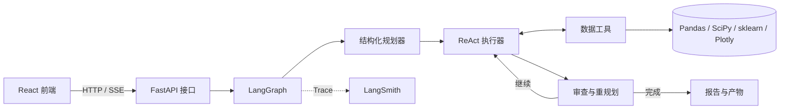

# 数据分析 Agent

一个前后端分离的全流程数据分析工作台。后端使用 LangChain、LangGraph、ReAct 与 Plan-and-Execute，前端使用 React；本地通过独立 HTTP/SSE 接口通信，生产构建可部署到 LangSmith Deployment。

## 架构



后端边界：

- `src/data_agent/api.py`：文件、配置、会话、SSE 分析和产物下载接口。
- `src/data_agent/agent.py`：`validate → plan → execute → replan → finalize` 状态图。
- `src/data_agent/tools.py`：检查、清洗、转换、统计、可视化和导出工具。
- `src/data_agent/deployment.py`：LangSmith Agent Server 图入口。
- `langgraph.json`：LangSmith Deployment 构建配置和自定义 FastAPI 路由。

前端边界：

- `frontend/` 是独立 Vite/React 项目。
- 前端不导入 Python，也不直接访问文件系统。
- 开发环境调用 `http://127.0.0.1:8000`；生产环境默认调用当前部署域名。

## Plan-and-Execute

每次分析会先生成 2 到 6 个结构化步骤。每一步由 ReAct Agent 使用受控工具执行，随后重规划器根据真实工具结果决定：

1. 删除已经没有价值的步骤。
2. 补充必要的后续分析。
3. 证据充分时提前结束。
4. 达到步骤上限时强制汇总，防止无限循环。

最终报告只能引用工具返回的统计数字和生成文件。

## 本地启动

要求 Python 3.11-3.13 和 Node.js 20 或更高版本。

双击 `run.bat`。第一次启动会安装依赖，然后分别启动：

- React：`http://127.0.0.1:5173`
- FastAPI：`http://127.0.0.1:8000`
- OpenAPI：`http://127.0.0.1:8000/docs`

也可以手动启动：

```powershell
.\.venv\Scripts\python.exe -m uvicorn data_agent.api:app --host 127.0.0.1 --port 8000
cd frontend
npm install
npm run dev
```

## API

主要接口：

- `GET /api/health`
- `GET /api/settings`
- `PUT /api/settings`
- `POST /api/sessions`：multipart 文件上传
- `GET /api/sessions/{id}`
- `POST /api/sessions/{id}/analyze`
- `POST /api/sessions/{id}/analyze/stream`：SSE 节点进度
- `GET /api/sessions/{id}/artifacts/{filename}`

## LangSmith

在 `.env` 或 LangSmith Deployment 的环境变量中配置：

```dotenv
DEEPSEEK_API_KEY=...
DEEPSEEK_MODEL=deepseek-v4-pro
LANGSMITH_TRACING=true
LANGSMITH_API_KEY=...
LANGSMITH_PROJECT=data-analysis-agent
```

启用后，规划、每个 ReAct 工具调用、重规划和最终汇总都会进入 LangSmith Trace。

### 部署

1. 构建前端：`cd frontend && npm ci && npm run build`。
2. 确保 `frontend/dist` 随代码提交到 GitHub。
3. 在 LangSmith 左侧进入 `Deployments`，创建部署并连接该仓库。
4. 在部署环境变量中填入 `DEEPSEEK_API_KEY`；LangSmith 服务密钥由部署环境管理。
5. 部署完成后直接打开部署 URL，`/docs` 可查看 Agent Server 与自定义 API。

LangSmith Cloud 会托管 Agent Server、线程、运行队列和检查点。本项目生成的数据文件当前保存在部署实例的 `runs` 目录；需要多副本扩缩容或长期保存上传文件时，应把 `DataWorkspace` 的文件层切换到 S3、OSS 或 Azure Blob。

## 质量检查

```powershell
.\.venv\Scripts\python.exe -m pytest
.\.venv\Scripts\python.exe -m ruff check .
cd frontend
npm run build
```

测试不调用真实 DeepSeek API，也不会产生模型费用。
